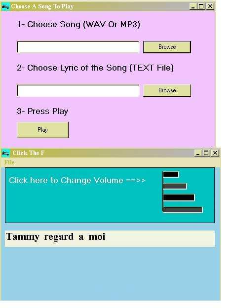



## Words\-With\-Song Ver2\.0

### Description

THis Code Enable you to See the Lyric(The Words of the Song) coming up on the screen in the same

time with the song
 
### More Info
 
You should write the Song in a text File and

Save it in the same directory as well as the

*.wav file and then adjust the updateIntrval

in the property of the MMControl

put "-" in the text File for every music without words

             |
---                |---
**Submitted On**   |2007-05-07 20:27:52
**By**             |[Waguih Youssef Sami](https://github.com/Planet-Source-Code/PSCIndex/blob/master/ByAuthor/waguih-youssef-sami.md)
**Level**          |Intermediate
**User Rating**    |4.0 (20 globes from 5 users)
**Compatibility**  |VB 5\.0, VB 6\.0
**Category**       |[Sound/MP3](https://github.com/Planet-Source-Code/PSCIndex/blob/master/ByCategory/sound-mp3__1-45.md)
**World**          |[Visual Basic](https://github.com/Planet-Source-Code/PSCIndex/blob/master/ByWorld/visual-basic.md)
**Archive File**   |[Words\-With206459582007\.zip](https://github.com/Planet-Source-Code/waguih-youssef-sami-words-with-song-ver2-0__1-68252/archive/master.zip)

